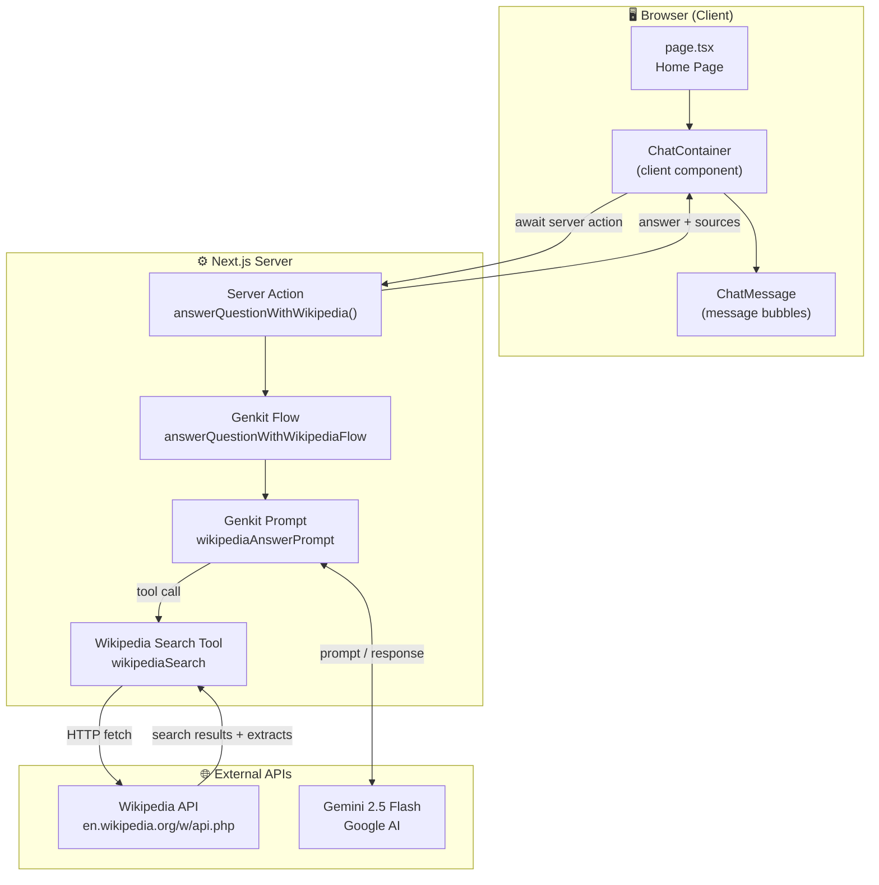
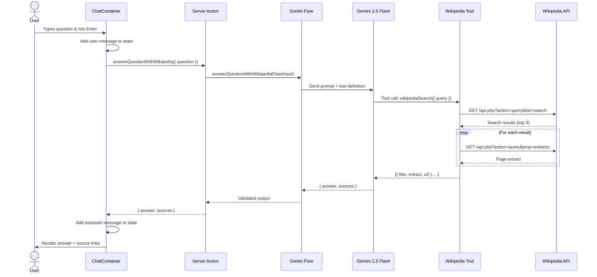

# WikiAgent — Architecture & Flow

## What Is This Project?

**WikiAgent** is an AI-powered Q&A web application. A user types a factual question, and the app searches Wikipedia, summarizes the results using Google's **Gemini 2.5 Flash** model (via [Genkit](https://firebase.google.com/docs/genkit)), and displays a concise answer with clickable source links — all inside a chat interface.

> **TL;DR:** User asks question → Gemini AI searches Wikipedia → synthesizes answer → shows it with sources.

---

## Tech Stack

| Layer | Technology |
|---|---| 
| **Framework** | Next.js 15 (App Router, React 19) |
| **Language** | TypeScript |
| **AI Orchestration** | [Genkit](https://firebase.google.com/docs/genkit) (`genkit` + `@genkit-ai/google-genai`) |
| **LLM** | Google Gemini 2.5 Flash |
| **UI Components** | [shadcn/ui](https://ui.shadcn.com/) (Radix primitives + Tailwind CSS) |
| **Styling** | Tailwind CSS 3 with custom HSL design tokens |
| **Icons** | Lucide React |
| **Validation** | Zod |
| **Containerization** | Docker (Node 20 Alpine) |

---

## Project Structure

```
adkagent-more-broken/
├── src/
│   ├── ai/                          # ← AI / Backend layer
│   │   ├── genkit.ts                #    Genkit instance + Gemini plugin
│   │   ├── dev.ts                   #    Dev server entry (loads .env & flows)
│   │   └── flows/
│   │       └── answer-question-with-wikipedia.ts  # The core AI flow
│   │
│   ├── app/                         # ← Next.js App Router
│   │   ├── layout.tsx               #    Root layout (fonts, Toaster)
│   │   ├── page.tsx                 #    Home page (header + ChatContainer)
│   │   ├── globals.css              #    Design tokens & Tailwind config
│   │   └── favicon.ico
│   │
│   ├── components/
│   │   ├── wiki-agent/              # ← App-specific components
│   │   │   ├── chat-container.tsx   #    Chat UI (state, input, submit)
│   │   │   └── chat-message.tsx     #    Single message bubble + sources
│   │   └── ui/                      #    ~42 shadcn/ui primitives
│   │
│   ├── hooks/
│   │   ├── use-toast.ts             #    Toast notification hook
│   │   └── use-mobile.tsx           #    Mobile breakpoint hook
│   │
│   └── lib/
│       └── utils.ts                 #    cn() helper (clsx + tailwind-merge)
│
├── .env                             # GOOGLE_GENAI_API_KEY
├── next.config.ts                   # TS/ESLint error suppression, image domains
├── tailwind.config.ts               # Tailwind theme extensions
├── DockerFile                       # Production container
├── PROBLEM_STATEMENT.md             # Hackathon challenge description
└── package.json                     # Scripts: dev, genkit:dev, build
```

---

## Architecture Diagram



---

## End-to-End Flow

Here's exactly what happens when a user asks a question:

### 1. User Submits a Question
- The user types into the `<Textarea>` inside **`ChatContainer`** and presses Enter (or clicks Send).
- `handleSubmit()` adds a `user` message to local state and calls the server action.

### 2. Server Action Invoked
- `answerQuestionWithWikipedia({ question })` is a **Next.js Server Action** (marked `'use server'`).
- It lives in `src/ai/flows/answer-question-with-wikipedia.ts`.
- It invokes the **Genkit flow** `answerQuestionWithWikipediaFlow`.

### 3. Genkit Flow Executes
- The flow calls `wikipediaAnswerPrompt(input)`, which sends the user's question to **Gemini 2.5 Flash** along with the system prompt and the `wikipediaSearch` tool definition.

### 4. Gemini Calls the Wikipedia Tool
- Gemini decides to use the `wikipediaSearch` tool.
- The tool makes **two HTTP calls per result** to the Wikipedia API:
  1. **Search API** — finds up to 3 matching articles.
  2. **Extracts API** — fetches the introductory text for each article.
- Returns an array of `{ title, extract, url }` objects back to Gemini.

### 5. Gemini Synthesizes the Answer
- Using the Wikipedia content, Gemini generates:
  - `answer` — a factual, concise response.
  - `sources` — an array of Wikipedia URLs it used.
- The response is validated against the **Zod output schema**.

### 6. Answer Displayed in Chat
- The flow returns the structured output to the client.
- `ChatContainer` creates an `assistant` message with `content` and `sources`.
- **`ChatMessage`** renders the answer bubble with clickable source badges.



---

## Key Components Deep Dive

### AI Layer (`src/ai/`)

| File | Purpose |
|---|---|
| `genkit.ts` | Creates the singleton Genkit `ai` instance with the Google AI plugin and sets `gemini-2.5-flash` as the default model. |
| `dev.ts` | Entry point for the Genkit dev server (`genkit start`). Loads `.env` and registers all flows. |
| `flows/answer-question-with-wikipedia.ts` | Defines the Wikipedia search **tool**, the answer **prompt**, and the **flow**. Exports `answerQuestionWithWikipedia()` as a server action. |

### Frontend Layer (`src/components/wiki-agent/`)

| Component | Role |
|---|---|
| `ChatContainer` | Client component. Manages message state, input, loading, and error handling. Calls the server action on submit. |
| `ChatMessage` | Stateless component. Renders user/assistant bubbles with avatars, role labels, and source link badges. |

### Data Shapes (Zod Schemas)

```typescript
// Input to the flow
{ question: string }

// Output from the flow
{
  answer: string,         // The synthesized factual answer
  sources: string[]       // Wikipedia URLs used as references
}

// Wikipedia tool output (internal)
[{
  title: string,          // Article title
  extract: string,        // Intro paragraph
  url: string             // Full Wikipedia URL
}]
```

---

## Running the App

| Command | What It Does |
|---|---|
| `npm run dev` | Starts the Next.js dev server (port 3000) |
| `npm run genkit:dev` | Starts the Genkit dev UI for testing flows standalone |
| `npm run build` | Production build |

> **Requires:** `GOOGLE_GENAI_API_KEY` set in `.env`

---

## Hackathon Context

This is the **"more-broken"** branch — a deliberately glitched copy of a working WikiAgent app. The hackathon challenge is to find and fix the intentional regressions so the app works end-to-end again (UI loads, questions get answered, sources display).
